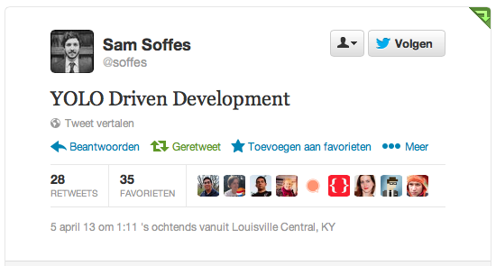

!SLIDE center


!SLIDE

# Updates

* Rails 4 RC!!
* Passenger 4 (én Enterprise)

!SLIDE center

# Test Driven Development

!SLIDE

# Ervaringen
## Jasmine

```javascript
describe("Calculator", function() {

  var calculator = new Calculator();

  it("should be able to add two number", function() {
    var calculation = calculator.add(2,3);
    expect(calculation).toEqual(5);
  })

})
```

http://github.com/NHLHogeschool/Jasmine

!SLIDE

# Waarom TDD?

* Expert programmeren;
* Hoge kwaliteit code;
* Zelfverzekerde deployment;
* Productiviteit!

!SLIDE center



!SLIDE

# TDD

* Spec je code uit;
* Doe een minimale implementatie;
* Sloop je spec;
* Enz.
* Refactor!